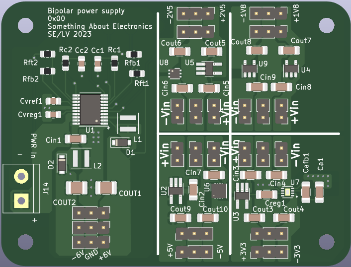
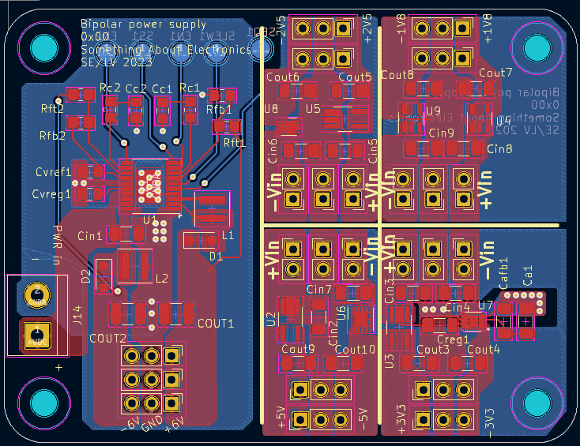

# BPSU
Bipolar power supply board, for op-amp's and other things

from input +5VD to +/-12VDC, with additional LDO'S for: +/-1.8V, +/-2.5V, +/-3.3V, +/-5V.

IC's used ADP5070, ADP7142 and ADP7182

 | 